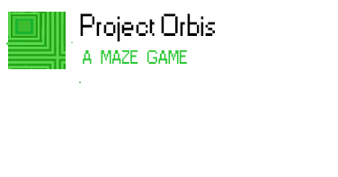

 

Our first foray into the world of game development!

# Some things we will learn
- Basics of Unity interface
- Basics unity scripting and component system
- Intro to unity physics (Collision and Rigidbody)
- Game theory
- Editor Tricks
- Some cool 'hacks' (Level Editor and asset serializer) 

# Links
[Maze Generator](http://hereandabove.com/maze/mazeorig.form.html)

[Maze Converter](https://www.browserling.com/tools/gif-to-png)
